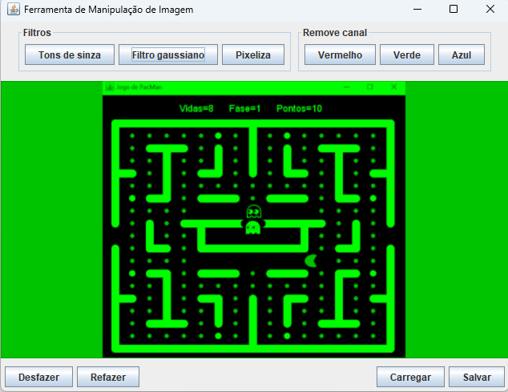

# Simples editor de imagens



<p>
  Este simples editor de imagens tem funções de filtros gaussiano, pixelização, conversão para tons de cinza, remoção de 
  canais de cores, desfazer e refazer, carregar imagens e salvar nos formatos: gif, jpg, png.
</p>

## Como rodar?

<p>
  Para rodar, descompacte o arquivo imagem-editor-1.0.zip, contido na raiz do projeto ou como release do github. Após descompactar, 
  use a linha de comandos para posicionar o diretório corrente na pasta compactada e, então, rode o seguinte comando.
</p>

```
java -jar imagem-editor-1.0.jar
```

|  :zap:  Atenção: é necessário o Java 11 ou superior instalado   |
|-----------------------------------------------------------------|

| :zap:  É necessário também, o caminho da pasta bin do java (JDK ou JRE) adicionados à variável de ambiente  |
|-------------------------------------------------------------------------------------------------------------|
