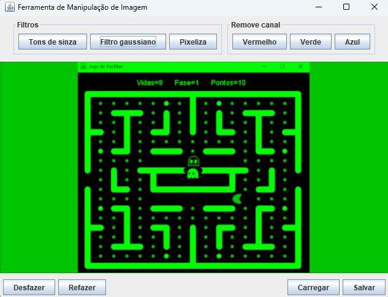

# Simples editor de imagens



Este simples editor de imagens tem funções de filtros gaussiano, pixelização, conversão para tons de cinza, remoção de 
canais de cores, desfazer e refazer, carregar imagens e salvar nos formatos: gif, jpg, png.

## O código fonte

O código fonte está estruturado no pacote principal: "italo.imagemeditor". Dentro deste pacote estão os seguintes 
pacotes e módulos:

* <b>controller</b>: Onde fica o tratamento de eventos. Isto é, os métodos a serem executados a cada evento de interface gráfica tratado;
* <b>desenho</b>: Onde fica o código dos filtros, efeitos e remoção de canais. A estrutura da classe PainelDesenho permite que se possa desfazer ou refazer alguma alteração no gráfico.
* <b>gui</b>: Onde fica o código da interface gráfica swing com a janela principal e o painel de desenho;
* <b>logica</b>: Onde tem apenas a classe utilitária de arquivos de imagem.

O pacote "controller", tem uma interface "Sistema" que tem os métodos de integração dos "controllers", com o restante do sistema.

## Como compilar e rodar?

<blockquote>
  <b>Atenção:</b> é necessário o Java 11 ou superior instalado
</blockquote>

Para compilar, você pode utiliar o maven ou importar em sua IDE de preferência o projeto como projeto maven.

### Compilando com o maven

<blockquote>  
  É necessário o mavem com o caminho dos binários adicionados à variável de ambiente "PATH"
</blockquote>

Navegue até a raiz do projeto, onde está o arquivo "pom.xml", e execute o seguinte comando:

```
mvn clean package
```

O resultado deste comando é o software empacotado como arquivo "Jar" e colocado na pasta "target".

### Rodando o projeto

<blockquote>
  É necessário o caminho da pasta bin do java (JDK ou JRE) adicionados à variável de ambiente "PATH"
</blockquote>

Para rodar, navegue pela linha de comandos até a pasta "target" e execute o seguinte comando:

```
java -jar imagem-editor-1.0.jar
```

## Como rodar a release?

<blockquote>
  É necessário o caminho da pasta bin do java (JDK ou JRE) adicionados à variável de ambiente "PATH"
</blockquote>

Para rodar, descompacte o arquivo imagem-editor-1.0.zip, contido na raiz do projeto ou como release do github. Após descompactar, 
use a linha de comandos para posicionar o diretório corrente na pasta compactada e, então, rode o seguinte comando.

```
java -jar imagem-editor-1.0.jar
```
